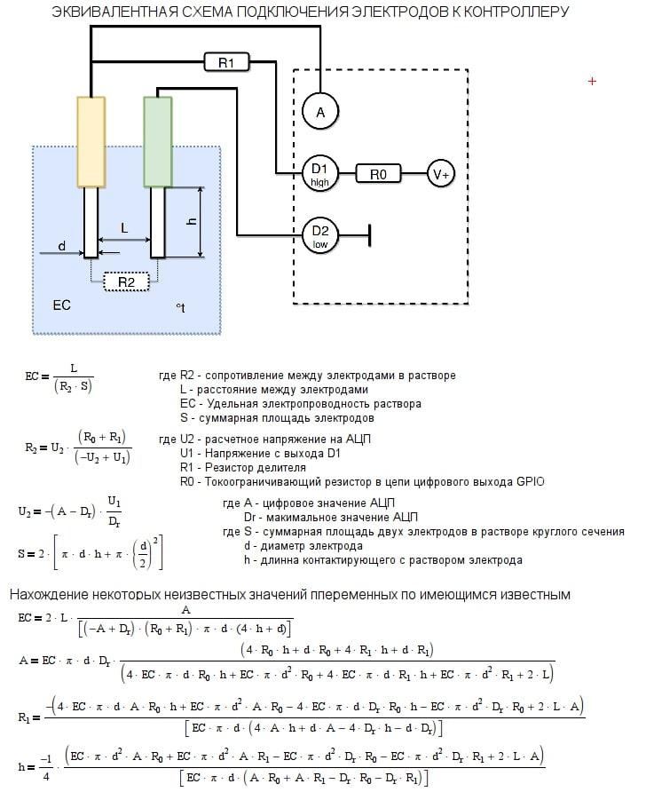

# Самодельный ес метр

## Схема 

[Модель для печати](./models/)

## Ссылки

* [Измеритель EC на основе Arduino](https://gidroponika.fandom.com/ru/wiki/%D0%98%D0%B7%D0%BC%D0%B5%D1%80%D0%B8%D1%82%D0%B5%D0%BB%D1%8C_EC_%D0%BD%D0%B0_%D0%BE%D1%81%D0%BD%D0%BE%D0%B2%D0%B5_Arduino)
* [Изготовление ЕС-метра с непрерывным измерением](http://forum.ponics.ru/index.php?topic=2645.msg120656#msg120656)
